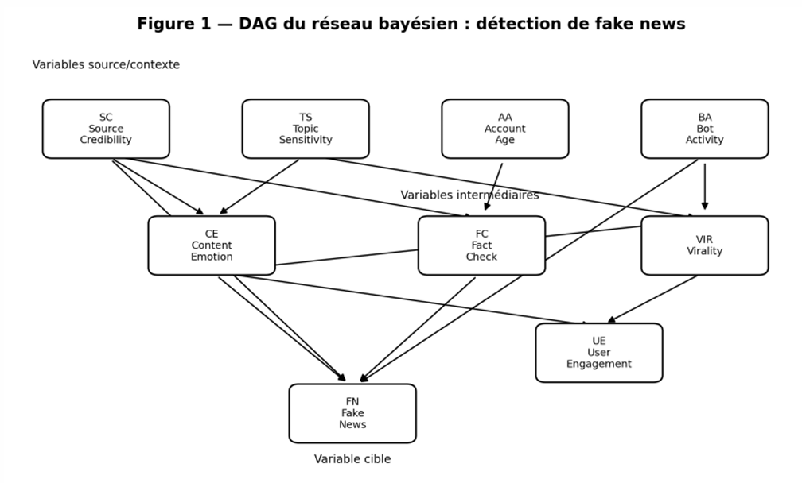
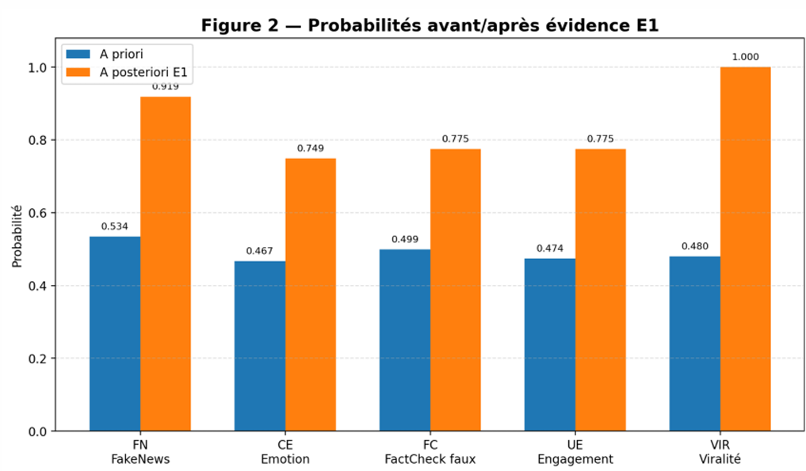
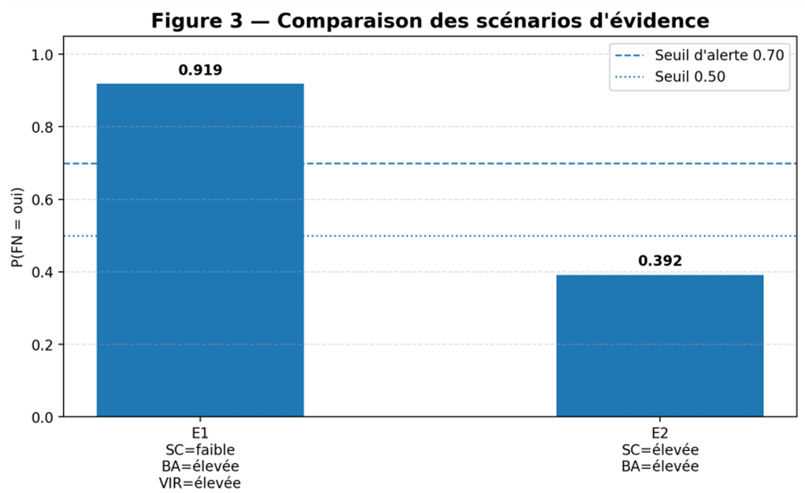

# Fake News Detection using Bayesian Networks

## Project Date

**April 2026**

## Overview

This project presents a probabilistic model for fake news detection on social networks using a **multiply-connected Bayesian Network**. The objective is to estimate the probability that a piece of information is false by combining uncertain and partially observable signals such as source credibility, bot activity, emotional content, virality and fact-checking status.

Unlike classical Machine Learning classification projects, this work focuses on **uncertainty modeling**, **causal reasoning** and **explainable probabilistic inference**.

## Project Context

Fake news spreads rapidly on social media platforms, often amplified by emotional content, bots and viral sharing mechanisms. Detecting misinformation is difficult because the available signals are incomplete, noisy and uncertain.

This project investigates the following question:

> How can we estimate the probability that online content is fake by combining uncertain signals in an explainable probabilistic framework?

## Bayesian Network Design

The model is built as a Bayesian Network with **9 variables** and **13 causal arcs**.

### Variables

| Variable | Meaning            | Values            |
| -------- | ------------------ | ----------------- |
| SC       | Source Credibility | low, medium, high |
| TS       | Topic Sensitivity  | low, high         |
| AA       | Account Age        | new, old          |
| BA       | Bot Activity       | low, high         |
| CE       | Content Emotion    | low, high         |
| VIR      | Virality           | low, high         |
| UE       | User Engagement    | low, high         |
| FC       | Fact Check         | false, true       |
| FN       | Fake News target   | no, yes           |

The target variable is:

```text
FN = FakeNews
```

## Causal Structure

The network combines three main groups of factors:

1. **Source and context**

   * Source credibility
   * Topic sensitivity
   * Account age

2. **Content and diffusion**

   * Emotional intensity
   * Bot activity
   * Virality
   * User engagement

3. **Decision layer**

   * Fact-checking
   * Fake news probability

The Bayesian Network is **multiply-connected**, meaning that information can propagate through several paths between variables. This requires probabilistic inference through a junction tree-based approach.

## Methodology

The project follows these main steps:

1. Definition of the fake news detection problem
2. Identification of uncertain variables
3. Construction of the Bayesian Network structure
4. Definition of causal dependencies
5. Construction of Conditional Probability Tables
6. Verification of the DAG structure
7. Inference using `LazyPropagation`
8. Evidence propagation
9. Analysis of prior and posterior probabilities
10. Comparison of contradictory evidence scenarios

## Implementation

The model was implemented using **pyAgrum**, a Python library for probabilistic graphical models.

Main implementation steps:

* Creation of Bayesian Network variables
* Definition of causal arcs
* Verification of DAG validity
* Confirmation of multiply-connected structure
* Construction of CPTs
* Inference using LazyPropagation
* Posterior probability analysis under evidence

## Evidence Scenario E1

A critical misinformation scenario was tested:

```text
BotActivity = high
Virality = high
SourceCredibility = low
```

This scenario represents a coordinated misinformation campaign where a low-credibility source is amplified by bots and reaches high virality.

## Results

### Prior vs Posterior Probabilities

| Variable              | Prior Probability | Posterior Probability under E1 | Interpretation           |
| --------------------- | ----------------: | -----------------------------: | ------------------------ |
| FakeNews = yes        |             0.534 |                          0.919 | Maximum alert            |
| ContentEmotion = high |             0.467 |                          0.749 | Strong emotional content |
| FactCheck = false     |             0.499 |                          0.775 | Likely not verified      |
| UserEngagement = high |             0.474 |                          0.775 | Amplified engagement     |
| Virality = high       |             0.480 |                          1.000 | Fixed evidence           |

The probability of fake news increases from **53.4%** to **91.9%** after evidence propagation.

## Contradictory Evidence Scenario

A second scenario was tested:

```text
SourceCredibility = high
BotActivity = high
```

This represents a contradictory situation where a credible source is amplified by bots.

| Scenario | Evidence                                                     | P(FakeNews = yes) |
| -------- | ------------------------------------------------------------ | ----------------: |
| E1       | BotActivity = high, Virality = high, SourceCredibility = low |             0.919 |
| E2       | SourceCredibility = high, BotActivity = high                 |             0.392 |

The model does not block under contradiction. Instead, it redistributes uncertainty and provides a more nuanced decision.

## Visual Results

### Bayesian Network Structure



### Impact of Evidence E1



### Scenario Comparison



## Project Structure

```text
fake-news-bayesian-network/
│
├── README.md
├── requirements.txt
├── .gitignore
│
├── notebooks/
│   └── fake_news_bayesian_network.ipynb
│
├── reports/
│   └── fake_news_bayesian_network_report.pdf
│
└── images/
    ├── bayesian_network_dag.png
    ├── evidence_impact.png
    └── scenario_comparison.png
```

## How to Run

### 1. Clone the repository

```bash
git clone https://github.com/arefbakali/fake-news-bayesian-network.git
cd fake-news-bayesian-network
```

### 2. Create a virtual environment

```bash
python -m venv .venv
```

### 3. Activate the environment

On Windows:

```bash
.venv\Scripts\activate
```

On macOS/Linux:

```bash
source .venv/bin/activate
```

### 4. Install dependencies

```bash
pip install -r requirements.txt
```

### 5. Open the notebook

```bash
jupyter notebook notebooks/fake_news_bayesian_network.ipynb
```

## Requirements

Main libraries used:

* Python
* pyAgrum
* NumPy
* Pandas
* Matplotlib
* Jupyter Notebook

## Key Takeaways

* Bayesian Networks are useful for modeling uncertainty in fake news detection.
* The model combines source, content, diffusion and verification signals.
* Evidence propagation makes the decision process explainable.
* Under a coordinated misinformation scenario, the probability of fake news rises to **91.9%**.
* Contradictory evidence is handled through probabilistic reasoning instead of rigid binary classification.

## Limitations

* Conditional Probability Tables were manually defined based on expert knowledge and literature.
* The model is not trained on a real social media corpus.
* Temporal dynamics of misinformation campaigns are not modeled.
* A Dynamic Bayesian Network could improve the representation of evolving campaigns.

## Future Improvements

* Learn CPTs from real labeled misinformation datasets
* Add temporal modeling using Dynamic Bayesian Networks
* Integrate NLP-based content features
* Add bot detection features from real social network activity
* Build a Streamlit interface for interactive evidence selection
* Add explanation dashboards for posterior probabilities

## Author

**Aref Bak Ali**<br>
AI, Data Science & Agentic AI Student<br>
GitHub: https://github.com/arefbakali<br>
LinkedIn: https://linkedin.com/in/aref-bak-ali/
